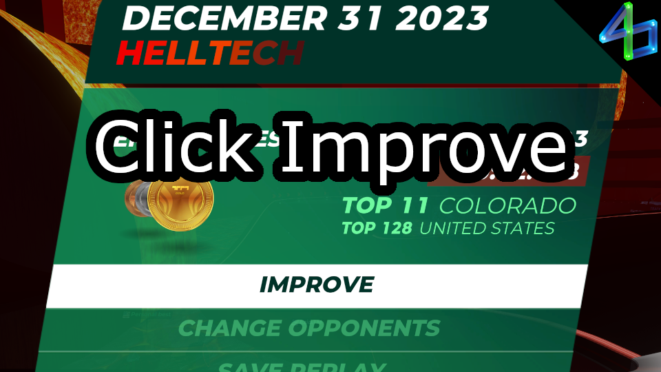

# Click Improve

When you finish a run, it can be annoying to click the "Improve" button to start another run, especially if you're playing with your HUD off. This plugin clicks that button for you so you can get right back to grinding!

There are some limitations:
- Only works when playing solo (should be obvious, the "Improve" screen doesn't appear on servers)

